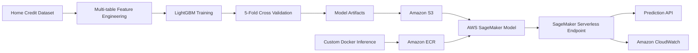

# Credit Risk ML Platform

[](https://github.com/iqbalabdulr/credit-risk-ml-platform/actions/workflows/ci.yml)

End-to-end machine learning project for credit default risk prediction using **LightGBM**, multi-table feature engineering, automated testing, Docker, and AWS SageMaker Serverless Inference.

The project focuses not only on model performance, but also on building a reproducible ML workflow from raw relational data to cloud deployment.

---

## Highlights

- Multi-table feature engineering from Home Credit Default Risk data
- Application, bureau, previous application, and installment history features
- **167 final model features**
- LightGBM classifier
- 5-fold stratified cross-validation
- Out-of-fold evaluation
- Automated decision-threshold selection
- Reproducible training pipeline
- Custom Docker inference container
- Amazon S3 model artifact storage
- Amazon ECR container registry
- AWS SageMaker Serverless Inference
- Amazon CloudWatch endpoint logging
- Unit testing with Pytest
- Continuous Integration with GitHub Actions

---

## Model Performance

| Metric | Result |
|---|---:|
| 5-Fold CV ROC-AUC | **0.7806 ± 0.0038** |
| 5-Fold CV PR-AUC | **0.2713 ± 0.0069** |
| F1 Decision Threshold | **0.16** |
| High-Recall Threshold | **0.10** |
| High-Recall Target | **≥ 60% recall** |

ROC-AUC and PR-AUC are evaluated using stratified cross-validation and out-of-fold predictions to reduce dependence on a single train-validation split.

---

## System Architecture



---

## Data Pipeline

The model combines information from multiple Home Credit tables.

```text
application_train
        |
        +---- bureau
        |       |
        |       +---- bureau_balance
        |
        +---- previous_application
        |
        +---- installments_payments
        |
        v
Customer-level aggregations
        |
        v
Application-level feature engineering
        |
        v
167 final model features
        |
        v
LightGBM
```

The project intentionally uses selected historical tables rather than maximizing the number of Kaggle features. The goal is to balance predictive performance with maintainable feature engineering and production deployment.

---

## Feature Engineering

### Application-Level Features

Examples include:

- Credit-to-income ratio
- Annuity-to-income ratio
- Credit-to-annuity ratio
- Goods-price-to-credit ratio
- Income per family member
- Applicant age
- Employment duration
- Employment-to-age ratio
- External score mean
- External score minimum
- External score maximum
- External score standard deviation

### Bureau History

Examples include:

- Number of bureau credit records
- Mean/min/max days since previous credit
- Total and average historical credit amount
- Total and average outstanding debt
- Overdue amount statistics
- Maximum days overdue
- Active and closed credit counts
- Bureau balance history statistics

### Previous Applications

Examples include:

- Number of previous applications
- Average requested credit
- Average approved credit
- Average annuity
- Application-to-credit ratio
- Previous application decision timing
- Payment-term statistics
- Approved/refused application counts

### Installment History

Examples include:

- Number of installments
- Payment percentage
- Payment difference
- Days past due
- Days before due
- Average installment payment amount

---

## Model Development

The modeling process progressed through increasingly stronger baselines.

```text
Logistic Regression Baseline
        ↓
LightGBM Baseline
        ↓
Application Feature Engineering
        ↓
Multi-table Historical Aggregation
        ↓
LightGBM V2
        ↓
5-Fold Stratified Cross Validation
```

The application-only LightGBM model achieved approximately:

```text
ROC-AUC ≈ 0.766
```

Adding bureau, previous application, and installment history improved validation performance to approximately:

```text
ROC-AUC ≈ 0.779
```

The final 5-fold cross-validation result was:

```text
ROC-AUC = 0.7806 ± 0.0038
PR-AUC  = 0.2713 ± 0.0069
```

This improvement showed that historical customer behavior provided useful information beyond the current loan application alone.

---

## Class Imbalance and Decision Thresholds

Credit default prediction is an imbalanced classification problem.

In the original training dataset, default cases represent only a small portion of applicants. Because of this, using a default classification threshold of `0.50` can result in poor recall for risky applicants.

The project therefore separates:

```text
Probability estimation
        ↓
Business decision threshold
```

Two operating thresholds are stored with the final model.

### F1-Oriented Threshold

```text
0.16
```

This threshold balances precision and recall by maximizing F1 score using out-of-fold predictions.

### High-Recall Threshold

```text
0.10
```

This operating point targets at least approximately:

```text
60% recall
```

It represents a use case where identifying a larger proportion of potentially risky applicants is more important than maximizing precision.

These thresholds demonstrate that classification decisions should be aligned with business objectives rather than automatically using `0.50`.

---

## Reproducible Training Pipeline

The training pipeline is implemented in:

```text
src/train.py
```

It performs:

1. Data loading
2. Multi-table aggregation
3. Application-level feature engineering
4. Feature type detection
5. LightGBM categorical feature preparation
6. 5-fold stratified cross-validation
7. Out-of-fold prediction generation
8. ROC-AUC and PR-AUC evaluation
9. Decision-threshold optimization
10. Final model training
11. Artifact generation

Run training using:

```bash
python -m src.train \
    --data-dir data \
    --artifact-dir artifacts
```

---

## Generated Model Artifacts

The training pipeline generates:

```text
artifacts/
├── credit_risk_lgbm_v2.pkl
├── feature_config.json
├── threshold_config.json
└── metrics.json
```

### `credit_risk_lgbm_v2.pkl`

Serialized final LightGBM classifier.

### `feature_config.json`

Stores:

- model version
- 167 feature names
- categorical feature names
- feature schema

### `threshold_config.json`

Stores:

- F1-oriented decision threshold
- high-recall threshold
- high-recall target

### `metrics.json`

Stores:

- cross-validation results
- ROC-AUC
- PR-AUC
- out-of-fold metrics
- selected decision thresholds

Large model binaries are intentionally excluded from Git.

---

## AWS Deployment Architecture

The final LightGBM model was deployed on AWS using a custom inference container.

```text
Model Artifacts
      |
      v
Amazon S3

Inference Application
      |
      v
Docker Image
      |
      v
Amazon ECR
      |
      v
AWS SageMaker Model
      |
      v
SageMaker Serverless Endpoint
      |
      v
Prediction API
      |
      v
Amazon CloudWatch
```

### Amazon S3

Model artifacts were packaged into:

```text
model.tar.gz
```

and stored in Amazon S3.

### Amazon ECR

A custom Docker inference image was built and pushed to Amazon Elastic Container Registry.

The image contains:

- Python 3.11
- LightGBM
- Pandas
- NumPy
- scikit-learn
- Joblib
- Flask
- Gunicorn
- Linux OpenMP runtime required by LightGBM

### AWS SageMaker

The S3 model artifact and ECR inference image were combined into an AWS SageMaker model and deployed using:

```text
SageMaker Serverless Inference
```

Serverless inference was selected for this portfolio deployment because the endpoint only needed to be available during testing and did not require continuously running compute instances.

---

## Custom Inference Container

The custom inference service is located in:

```text
inference/
```

The container implements SageMaker-compatible endpoints:

```text
GET  /ping
POST /invocations
```

### Health Check

```text
GET /ping
```

returns:

```text
HTTP 200 OK
```

when the model is loaded successfully.

### Prediction Request

```text
POST /invocations
```

accepts JSON containing the final model feature schema.

The current inference service expects **167 precomputed model features**.

Raw bureau, installment, and previous-application tables are processed upstream by the feature engineering pipeline.

---

## Example Inference Response

Example response format:

```json
[
  {
    "default_probability": 0.42,
    "prediction_f1": 1,
    "prediction_high_recall": 1
  }
]
```

Where:

```text
default_probability
```

is the LightGBM predicted default probability.

```text
prediction_f1
```

uses the F1-oriented threshold.

```text
prediction_high_recall
```

uses the high-recall operating threshold.

---

## Deployment Validation

The deployment was validated before the temporary AWS endpoint was removed.

### Container Health Check

The local Docker container successfully returned:

```text
HTTP/1.1 200 OK
```

from:

```text
GET /ping
```

### SageMaker Runtime Test

A smoke-test payload containing the complete 167-feature schema was sent to the SageMaker Serverless Endpoint.

The deployed model successfully returned:

```json
[
  {
    "default_probability": 0.844873127662527,
    "prediction_f1": 1,
    "prediction_high_recall": 1
  }
]
```

The example payload was created only to verify deployment functionality and should **not** be interpreted as a meaningful credit-risk assessment.

---

## Local vs Cloud Inference Consistency

The same payload was sent to:

```text
Local Docker Container
```

and:

```text
AWS SageMaker Serverless Endpoint
```

Both environments returned the same probability:

```text
Local Docker : 0.844873127662527
SageMaker    : 0.844873127662527
```

This verified that model inference remained consistent between the local Docker environment and AWS deployment.

---

## Monitoring

SageMaker automatically published endpoint logs to Amazon CloudWatch.

The endpoint generated the CloudWatch log group:

```text
/aws/sagemaker/Endpoints/credit-risk-serverless-endpoint
```

CloudWatch provided runtime visibility for the deployed inference container.

Potential production extensions include monitoring:

- Invocation count
- 4XX errors
- 5XX errors
- Model latency
- Serverless overhead latency
- Prediction distribution
- Data drift

The temporary SageMaker endpoint and ECR deployment resources were removed after validation to avoid unnecessary cloud compute charges.

---

## Continuous Integration

This repository uses **GitHub Actions** for automated validation.

The CI workflow runs automatically on:

```text
push → main
pull request → main
```

The pipeline performs:

```text
Checkout Repository
        ↓
Setup Python 3.11
        ↓
Install Dependencies
        ↓
Python Syntax Checks
        ↓
Pytest Unit Tests
```

The current test suite validates:

- Application-level feature engineering
- Multi-table feature aggregation
- Bureau features
- Previous-application features
- Installment features

Run the same tests locally using:

```bash
python -m pytest -q
```

---

## Repository Structure

```text
credit-risk-ml-platform/
│
├── src/
│   ├── __init__.py
│   ├── features.py
│   └── train.py
│
├── inference/
│   ├── app.py
│   ├── serve.py
│   ├── Dockerfile
│   └── requirements.txt
│
├── tests/
│   └── test_features.py
│
├── notebooks/
│
├── .github/
│   └── workflows/
│       └── ci.yml
│
├── pytest.ini
├── requirements.txt
├── .gitignore
└── README.md
```

---

## Dataset

This project uses the **Home Credit Default Risk** dataset.

The required files are:

```text
application_train.csv
bureau.csv
bureau_balance.csv
previous_application.csv
installments_payments.csv
```

Place them inside:

```text
data/
```

The dataset files are intentionally excluded from this repository.

---

## Running Locally

### Clone

```bash
git clone https://github.com/iqbalabdulr/credit-risk-ml-platform.git
cd credit-risk-ml-platform
```

### Install Dependencies

```bash
pip install -r requirements.txt
```

### Run Tests

```bash
python -m pytest -q
```

### Train Model

```bash
python -m src.train \
    --data-dir data \
    --artifact-dir artifacts
```

---

## Docker Inference

The custom SageMaker-compatible inference container is located in:

```text
inference/
```

Build the image:

```bash
cd inference
docker build -t credit-risk-inference .
```

The container expects the model artifacts to be mounted at:

```text
/opt/ml/model
```

which matches the SageMaker hosting model directory.

---

## Tech Stack

### Machine Learning

`Python` · `Pandas` · `NumPy` · `scikit-learn` · `LightGBM`

### ML Engineering

`Feature Engineering` · `Cross Validation` · `OOF Evaluation` · `Threshold Optimization`

### Software Engineering

`Pytest` · `GitHub Actions` · `Docker` · `Flask` · `Gunicorn`

### AWS

`Amazon S3` · `Amazon ECR` · `Amazon SageMaker` · `Amazon CloudWatch`

---

## Limitations

This project is designed as an ML engineering portfolio project rather than a production lending system.

Current limitations include:

- The inference endpoint expects the final 167-feature model schema rather than raw relational records.
- Historical aggregations are currently performed offline.
- Probability calibration has not yet been added.
- Model explainability is not yet exposed through the inference API.
- Production data drift monitoring is not implemented.
- Fairness and lending-policy validation would be required before any real-world financial decision use.
- Model predictions should not be interpreted directly as lending decisions.

---

## Future Improvements

Potential extensions include:

- SageMaker Model Registry
- Model versioning
- SHAP-based explainability
- Probability calibration
- Data drift monitoring
- Prediction drift monitoring
- Feature validation
- Automated Docker build and ECR push
- Automated SageMaker deployment
- Raw multi-table online preprocessing
- Infrastructure as Code
- Model rollback strategy
- Canary or shadow deployment
- Production API authentication

---

## Project Goal

The goal of this project is to demonstrate the complete lifecycle of a machine learning system:

```text
Raw Data
   ↓
Feature Engineering
   ↓
Model Development
   ↓
Cross Validation
   ↓
Model Artifact
   ↓
Automated Testing
   ↓
Containerization
   ↓
Cloud Deployment
   ↓
Inference Validation
   ↓
Monitoring
```

rather than focusing only on notebook-based model training.
