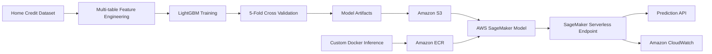

# Credit Risk ML Platform

End-to-end machine learning project for credit default risk prediction using **LightGBM**, multi-table feature engineering, automated testing, Docker, and AWS SageMaker Serverless Inference.

The project focuses not only on model performance, but also on building a reproducible ML workflow from raw relational data to cloud deployment.

## Highlights

- Multi-table feature engineering from Home Credit Default Risk data
- Application, bureau, previous application, and installment history features
- **167 final model features**
- LightGBM classifier with 5-fold stratified cross-validation
- Automated threshold selection for F1 and high-recall use cases
- Reproducible training pipeline
- Dockerized custom inference service
- AWS ECR container registry
- AWS SageMaker Serverless Inference deployment
- CloudWatch endpoint logging
- Unit tests with Pytest
- CI pipeline with GitHub Actions

## Model Performance

| Metric | Result |
|---|---:|
| 5-Fold CV ROC-AUC | **0.7806 ± 0.0038** |
| 5-Fold CV PR-AUC | **0.2713 ± 0.0069** |
| F1 Decision Threshold | **0.16** |
| High-Recall Threshold | **0.10** |
| High-Recall Target | **≥ 60% recall** |

ROC-AUC and PR-AUC are reported using cross-validation / out-of-fold evaluation to reduce dependence on a single train-validation split.

## System Architecture



## Data Pipeline

The model combines information from multiple Home Credit tables:

```text
application_train
        |
        +---- bureau
        |       |
        |       +---- bureau_balance
        |
        +---- previous_application
        |
        +---- installments_payments
        |
        v
Customer-level aggregations
        |
        v
Application-level engineered features
        |
        v
167 model features
        |
        v
LightGBM
```

Examples of engineered features include:

- credit-to-income ratio
- annuity-to-income ratio
- credit-to-annuity ratio
- income per family member
- applicant age
- employment duration
- external score statistics
- bureau credit/debt aggregations
- previous application statistics
- approved/refused application counts
- installment payment ratios
- days past due statistics

## Model Development

The project compares increasingly stronger approaches:

```text
Logistic Regression baseline
        ↓
LightGBM baseline
        ↓
Application feature engineering
        ↓
Multi-table historical aggregation
        ↓
LightGBM V2
        ↓
5-Fold Stratified Cross Validation
```

Adding historical bureau, previous application, and installment information improved validation performance over the application-only model.

## Decision Thresholds

Credit default prediction is highly imbalanced, so using only a default probability threshold of `0.50` is not appropriate for every business objective.

Two operating modes are stored with the model:

```text
F1-oriented threshold
0.16

High-recall threshold
0.10
```

The high-recall operating point is designed for use cases where detecting a larger proportion of risky applicants is more important than maximizing precision.

## AWS Deployment

The trained model was deployed through the following AWS architecture:

```text
Model artifacts
      |
      v
Amazon S3

Custom inference container
      |
      v
Amazon ECR
      |
      v
AWS SageMaker
      |
      v
Serverless Endpoint
      |
      v
CloudWatch Logs
```

A custom inference container was used to support the LightGBM model, categorical feature schema, and decision-threshold logic.

The container exposes the SageMaker-compatible endpoints:

```text
GET  /ping
POST /invocations
```

The deployment was validated by sending the same inference payload to both:

- the local Docker container
- the SageMaker Serverless Endpoint

Both returned the same model probability, confirming inference consistency between local and cloud execution.

The live AWS resources were removed after validation to avoid unnecessary cloud charges.

## Repository Structure

```text
credit-risk-ml-platform/
├── src/
│   ├── __init__.py
│   ├── features.py
│   └── train.py
│
├── inference/
│   ├── app.py
│   ├── serve.py
│   ├── Dockerfile
│   └── requirements.txt
│
├── tests/
│   └── test_features.py
│
├── notebooks/
│
├── .github/
│   └── workflows/
│       └── ci.yml
│
├── pytest.ini
├── requirements.txt
├── .gitignore
└── README.md
```

Large datasets and trained model binaries are intentionally excluded from Git.

## Running the Tests

Install dependencies:

```bash
pip install -r requirements.txt
```

Run:

```bash
python -m pytest -q
```

The same test suite runs automatically through GitHub Actions on pushes and pull requests to `main`.

## Training

Place the Home Credit dataset files inside:

```text
data/
```

Required files:

```text
application_train.csv
bureau.csv
bureau_balance.csv
previous_application.csv
installments_payments.csv
```

Then run:

```bash
python -m src.train --data-dir data --artifact-dir artifacts
```

The training pipeline performs:

1. multi-table aggregation
2. feature engineering
3. categorical feature preparation
4. 5-fold stratified cross-validation
5. out-of-fold evaluation
6. decision-threshold selection
7. final LightGBM training
8. artifact generation

## Generated Artifacts

The training pipeline creates:

```text
artifacts/
├── credit_risk_lgbm_v2.pkl
├── feature_config.json
├── threshold_config.json
└── metrics.json
```

Model binaries are excluded from Git because they are deployment artifacts rather than source code.

## Inference Output

Example response:

```json
[
  {
    "default_probability": 0.42,
    "prediction_f1": 1,
    "prediction_high_recall": 1
  }
]
```

`default_probability` represents the model-estimated default risk score, while the two predictions use different operating thresholds.

## Tech Stack

**Machine Learning**

`Python` · `Pandas` · `NumPy` · `scikit-learn` · `LightGBM`

**MLOps / Software Engineering**

`Pytest` · `GitHub Actions` · `Docker` · `Gunicorn` · `Flask`

**AWS**

`Amazon S3` · `Amazon ECR` · `Amazon SageMaker` · `CloudWatch`

## Limitations

- The inference endpoint currently expects the final model feature schema rather than raw relational tables.
- Historical aggregation is performed upstream by the feature pipeline.
- The project demonstrates deployment architecture and reproducibility rather than a production lending decision system.
- Model predictions should not be interpreted as lending decisions without additional calibration, governance, fairness analysis, and business validation.

## Future Improvements

Potential extensions include:

- model registry and model versioning
- data and prediction drift monitoring
- automated Docker build and ECR deployment
- feature validation
- probability calibration
- SHAP-based model explainability
- raw multi-table online preprocessing
- infrastructure-as-code
